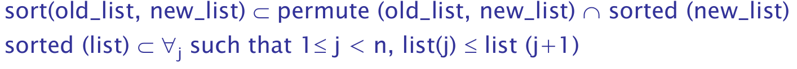

# Chapter 6

Logic

* formal
  * deductive - sentential logic
  * inductive
* informal

symbolic

* 任何值一出現即有意義

declarative

* 值的出現需賦予值

Example \(sorting\)

ppt p5$$$$

### predicate calculate \(謂詞演算\)

proposition

* 一個邏輯的描述是True 或 False

-

Axioms

* 公理
* e.g. Natural\(2\)

-

Symbolic Logic

-

Object

* proposition
* assertion
* variable
* constant

-

connective

Compound Terms

* Fact的定義
* e.g.
  * student\(popo\)
  * man\(john\)
  * like\(popo, rs\)

proposition的形式

* Fact
  * father\(Bob, Bill\)
* Query
  * ?-father\(Bob, Bill\)

-

1. Atomic proposition
2. Compound proposition

operator

quantifier

## Clausal Form

left side : consequence right side:antecedent

### Horn Clause

* Headed : b sentence 只有 1 個
* Headless : b sentence == 0

## Predictive Calculus

* resolution

## Unification

* instantiation : 把所有database中可能的object帶入variable，以找到符合的rule
  * 若失敗，backtrack反
* 反證法
  * high complexity

